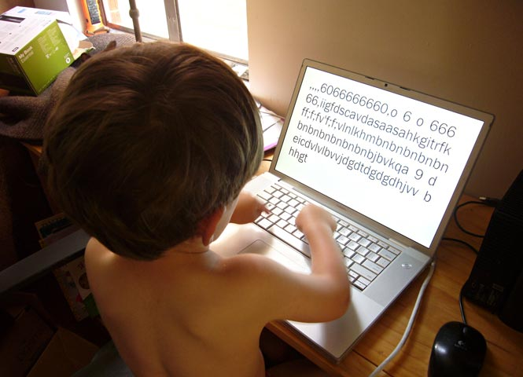

# tyketype

* ultra-minimal typing app for toddlers on osx
* known to be working in osx 10.15.7
* created with openframeworks 11.2
* no rights reserved

---

instructions: 

* in GitHub, click the green "Code" button; then "Download ZIP"
* in OSX, launch *TykeTypeDev* from the ```tyketype_app``` folder. 
* don't separate the app from the ```data``` folder that contains the font it needs, or it won't launch.
* if MacOS complains that TykeType "is damaged and can’t be opened", then in your Terminal, ```cd tyketype_app``` and then ```xattr -cr TykeTypeDev.app/```, which removes extended file attributes. 
* press command-q to quit. 
* you may need to [change your settings](https://support.apple.com/guide/mac-help/use-keyboard-function-keys-mchlp2596/mac) to “Use F1, F2, etc. keys as standard function keys”


